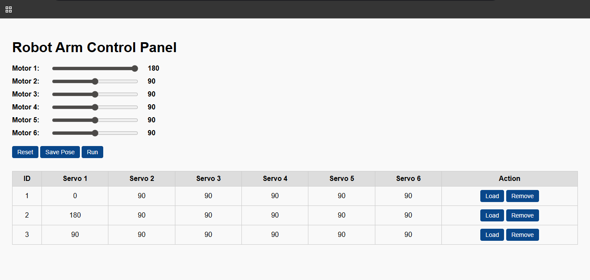
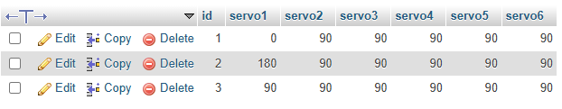
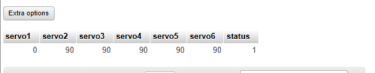
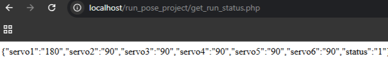
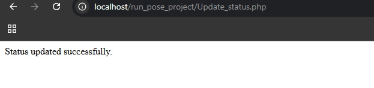

# Robot Arm Control Panel

## Objective  
Create a responsive web interface using **HTML, CSS, JavaScript, PHP, and MySQL** to control and manage a robot arm’s motor positions (servo values). The user can save motor poses, view saved poses, load them, remove them, and run the current configuration.

---

## Description  
This project enables users to control **servo motor angles** through a simple and intuitive web interface. Users can input values for six servos and choose to either save the pose or run it immediately. When the **Save Pose** button is clicked, the pose is stored in the **Pose** table of a **MySQL** database. If the **Run** button is used instead, the pose is saved in the **Run** table with its `status` set to **1**, indicating it is ready for execution. A background process continuously checks the database for a pose with `status = 1`, reads the servo angles when found, and updates the `status` to **0** after execution to avoid repetition. This system ensures that only one pose is active at a time and streamlines the control of servo motors through automated backend logic.

---

## Tools and Platform  
- **Platform**: Visual Studio Code, XAMPP (Apache + MySQL)  
- **Languages**: HTML5, CSS3, PHP  
- **Database**: MySQL (via phpMyAdmin)  
- **Design Techniques**:
  - Structured backend using `db.php`, `get_run_status.php`, and `update_status.php`
  - Reusable PHP logic for database connectivity
  - Lightweight and functional interface


---

## File Structure

```
/run_pose_project/
│
├── db.php               # Connects to the MySQL database (used in all PHP scripts)
│
├── index.html           # Main web interface for viewing, saving, and running poses
│
├── style.css            # Styles the web page (layout, buttons, colors)
│
├── script.js            # Handles button actions and sends AJAX requests to the PHP backend
│
├── save_pose.php        # Saves a pose (servo angles) into the 'pose' table in the database
│
├── run_pose.php         # Copies a selected pose into the 'Run' table with status = 1 
│
├── update_status.php    # Called after running the pose; resets Run.status to 0
│
├── get_run_status.php   # Called by to get the pose from 'Run' table only if status = 1
│
└── remove.php            # Deletes a pose entry from the 'pose' table when the user clicks "Remove"
```

---

##  Database Setup
The database named `Data_pose` contains two main tables:

**Pose**  
Stores saved servo motor angles with the following fields:  
- `id` (INT, auto-increment, primary key)  
- `servo1` (FLOAT)  
- `servo2` (FLOAT)  
- `servo3` (FLOAT)  
- `servo4` (FLOAT)  
- `servo5` (FLOAT)  
- `servo6` (FLOAT)  

**Run**  
Stores servo angles set for execution along with a status indicator, containing these fields:  
- `servo1` (FLOAT)  
- `servo2` (FLOAT)  
- `servo3` (FLOAT)  
- `servo4` (FLOAT)  
- `servo5` (FLOAT)  
- `servo6` (FLOAT)  
- `status` (TINYINT)  

---

##  Features

-  **Motor Sliders (0–180)**: Adjust 6 servo motors in real time.
-  **Save Pose**: Store current configuration into the database.
-  **Reset**: Reset all sliders to 90.
-  **Run**: Save current values to `Run` table and mark status as active.
-  **Pose Table**: Displays all saved poses with buttons:
-  **Load**: Load pose into sliders.
-  **Remove**: Delete pose from database.

---

## Project Screenshot  
Below are screenshots demonstrating the panel interface and database view:

- **Panel Interface**  
  

- **MySQL Pose Table**  
  
  
- **MySQL Run Table**  
  

- **Get run page**
  
  

- **Update status page**
  
  


---

## Created By  
- **Name**: Aghadi Saleh Al-rebdi   
- **Department**: Computer Science  
- **Year**: 2025  


